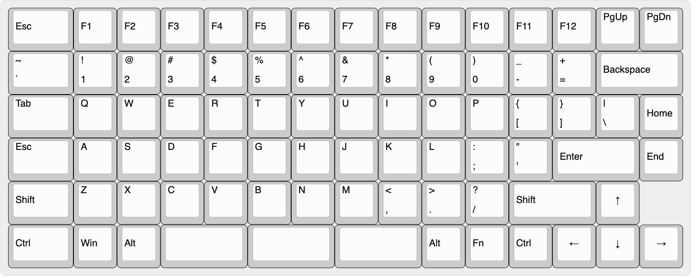

# Penguin

More experimental board.

- Ortholinear
- Cherry MX Clear switches
- More compact layout
- 3 keys in space-bar area
- Maintain function row
- More blank keys for better layering

## Hardware

- DSA keycaps
    - https://pimpmykeyboard.com/sp-dsa-black-white-keyset-two-shot/
        - Alpha Kit Black with White
            - 53 of needed 1x1
            - Black color code: NN
        - ~~Alternate Kit White with black~~
    - https://pimpmykeyboard.com/sp-dsa-1-space/
        - remaining 18x 1x1's in white (WAN)
    - https://pimpmykeyboard.com/sp-dsa-2-space/
        - 6x 2x1 (WAN)
- Key counts
    - 6x 1.5x1
    - 6x 2x1
    - 71x 1x1
